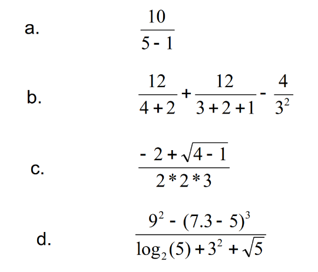

## Lógica da programação (de computadores) e análise de dados no R.

Instalar versão atualilzada do Rstudio
[http://www.rstudio.com/]()

 

**Aula1.R** até os exercícios

## Exercício 1 (calculadora)

Muitos dos erros cometidos por iniciantes no R estão relacionados com parênteses:

## Exercício 2 (manipulação de objetos)

