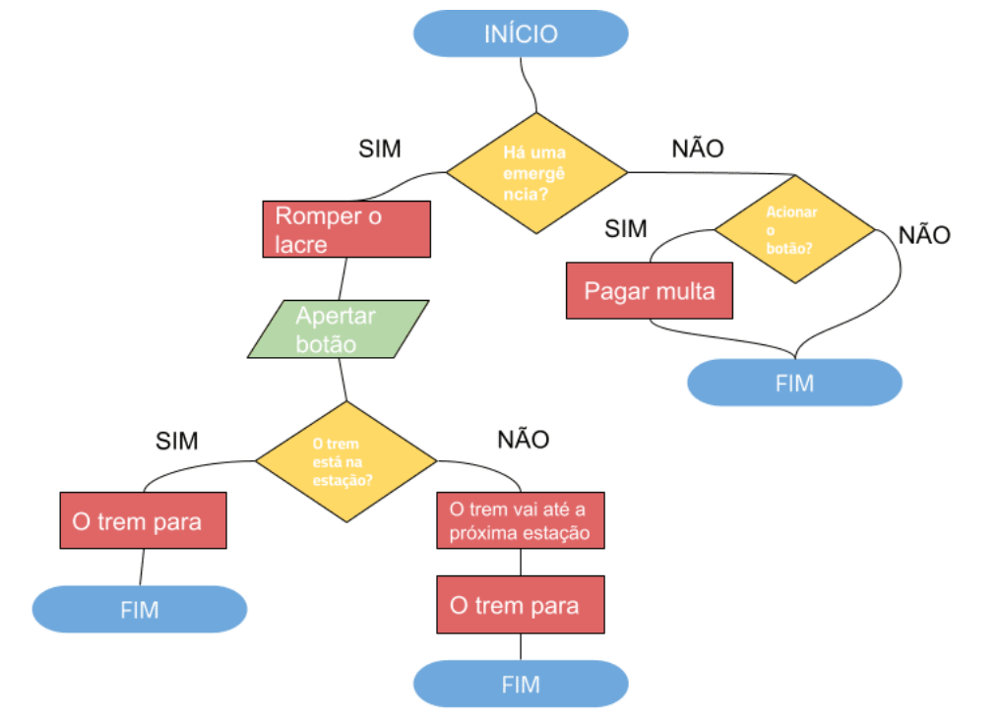
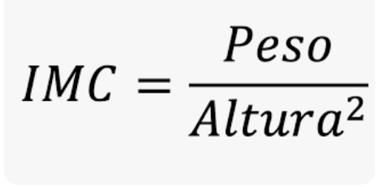
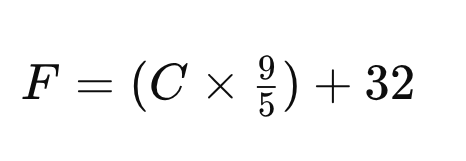
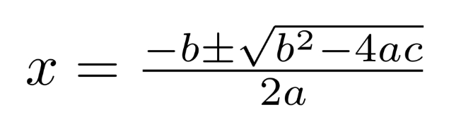

## <span style="font-size:40pt">Algoritmos</span>

**Algoritmo** é uma série de passos lógicos para resolver um problema.  

**Exemplos:** receita de um bolo, trocar um pneu, somar dois números.
<p>
Formas de representação de algoritmos:  
1. Textual  
2. Fluxograma  
3. Linguagem de programação  

## <span style="font-size:40pt">**1. Representação Textual de algoritmos**</span>

Tarefa: somar dois números.  
<p>
Passo a passo:  
<p>
1. (INPUT) Pegue os dois números (x1 e x2)   
2. (OPERAÇÃO) Realize a soma (xt = x1 + x2)   
3. (OUTPUT) Devolva o resultado (xt)

::: callout-tip
Dica: ao escrever em texto, procure usar **verbos no imperativo** (pegue, calcule, devolva) ao nomear inputs/outputs**.
:::

## <span style="font-size:40pt">**2. Representação de algoritmos por Fluxogramas**</span>

O fluxograma do nosso programa possui  
*entradas → operações → saída*   
de forma visual.

<br>

```{mermaid}
%%{init: {'theme': 'default', 'themeVariables': { 'fontSize': '32px' }}}%%
flowchart LR
    A[/Inputs: x1, x2/] --> B[Operações: xt = x1 + x2]
    B --> C[/Output: xt/]
```

## <span style="font-size:40pt">**Exemplo de fluxograma mais complexo**</span>



## <span style="font-size:40pt">**3.  Algoritmos como  Linguagens de programação**</span>

Pode ser implementado em diferentes linguagens: BASIC, Pascal, Java, Python, R, etc.

A lógica da programação (objetivo desta aula) é universal para todas as linguagens. Mudam apenas a sintaxe e a semântica.

Um algoritmo pode ser implementado de diferentes maneiras com a mesma linguagem, criando assim diferentes programas com os mesmos procedimentos.

## <span style="font-size:40pt">**Relembrando tipos de dados **</span>

- Numérico (x = 12): Operações: + - * / ^
- String (s = 'olá!'): Operações: paste(s1,s2)
- Lógico (TRUE ou FALSE). Pode ser abreviado (T ou F). Operações: < > <= >= ==.

## Funções

<br>

**Funções** existem em todas as linguagens de programação e funcionam como um programa inteiro, podendo conter INPUTS, OPERAÇÕES e OUTPUTS.

## <span style="font-size:32pt">**A estrutura de uma função no R**</span>

>  minha_funcao = function(input1, input2) {  
>   ... operações ...  
>  return(output)  
>  }  

-  **Minha_funcao** é o nome da funcão.  
- **{ }** representam o início e o fim da função.
-  **Function** e **return**: palavras reservadas do R.
 - **Operações** são os cálculos que geram o output.

## <span style="font-size:40pt">**Exemplos de funções no R**</span>

Exemplo 1: Função para somar dois números.

```r
soma2num = function(x1,x2) {
  x_tot = x1 + x2
  return(x_tot)
}
# Testando a função
soma2num(12,14)
```
Exemplo 2: Função para concatenar duas strings.

```r
alo_mundo = function(s1,s2) {
  s = (paste(s1, s2))
  return(s)
}
# Testando a função
alo_mundo('Hello,','world!')
```

## <span style="font-size:40pt">**Exercícios de funcões no R**</span>

**Exercício 1**: Crie uma função que receba dois números e realize a multiplicação entre eles.  

:::{.fragment}
**Exercício 2**: Escreva uma função que receba três números e imprima a média deles.
:::

:::{.fragment}
**Exercício 3**: Crie uma função que receba dois números (**a** e **b**) e eleve o valor de **a** pelo de **b**.
:::

:::{.fragment}
**Exercício 4**: Crie uma função que receba o valor do raio e devolva o valor da circunferência de um círculo. 
:::
 

## <span style="font-size:40pt">**Mais exercícios de funcões no R**</span>

**Exercício 5**: Crie uma função que receba o valor do raio e devolva o valor da circunferência **e** da área de um círculo.  

:::{.fragment}
**Exercício 6**: Crie uma função que receba do usuário a sua altura e o seu peso e mostre na tela o seu Índice de Massa Corporal (IMC): 


:::


## <span style="font-size:40pt">**Mais exercícios de funcões no R**</span>

**Exercício 7**: Faça um programa que receba do usuário um valor de temperatura em graus Célsius e mostre na tela o valor transformado em graus Fahrenheit:

{width=50%}  

**Exercício 8**: Crie uma função que receba um valor em Dólar e converta o valor para Real, considerando que 1 Dólar = 5,7 reais.

## <span style="font-size:40pt">**Mais exercícios de funções no R**</span>

**Exercício 9**: A partir da fórmula quadrática, crie uma função que receba os valores de **a**, **b** e **c** e devolva as duas raizes quadráticas.  

 

## <span style="font-size:40pt">**Estruturas de Condição em R**</span>

Estruturas de condição permitem que o programa tome decisões com base em uma verificação lógica.  

Em R, a verificação lógica resulta em **TRUE** (verdadeiro) ou **FALSE** (falso).  

<p><p>

Exemplo:
```r
x = 10
x > 5
# Resultado: TRUE
```

## <span style="font-size:40pt">**Estrutura básica if**</span>

Usada quando queremos executar um bloco de código apenas se uma condição for verdadeira.

Sintaxe:
```r
if (condição) {
  # código a ser executado se a condição for verdadeira
}
```

Exemplo:
```r
x = 7
if (x > 5) {
  print("x é maior que 5")
}
```

## <span style="font-size:40pt">**Estrutura if...else**</span>

Permite executar um código quando a condição é verdadeira e outro quando é falsa.

Sintaxe:
```r
if (condição) {
  # código se verdadeiro
} else {
  # código se falso
}
```

Exemplo:
```r
idade = 16
if (idade >= 18) {
  print("Maior de idade")
} else {
  print("Menor de idade")
}
```

## <span style="font-size:30pt">**Estrutura if...else if...else**</span>  
Permite testar várias condições em sequência.  
Sintaxe:
```r
if (condição1) {
  # código se condição1 for verdadeira
} else if (condição2) {
  # código se condição2 for verdadeira
} else {
  # código se nenhuma condição for verdadeira
}
```  
Exemplo:
```r
nota = 8
if (nota >= 9) {
  print("Excelente")
} else if (nota >= 7) {
  print("Bom")
} else {
  print("Precisa melhorar")
}
```

## <span style="font-size:30pt">**Exercícios de *if...else* **</span>  

**Exercício 10:** Escreva uma função que receba do usuário um valor numérico e mostre na tela se é positivo ou negativo.

**Exercício 11:** Escreva um código que leia um número inteiro (variável num) e verifique:  
- se é positivo, imprima "Número positivo"  
- se é negativo, imprima "Número negativo"  
- se for zero, imprima "Número neutro"  

**Exercício 12:** Crie uma função que receba do usuário um valor e mostre na tela se é par ou impar (use o operador %%).

## <span style="font-size:30pt">**Exercícios de *if...else* **</span>  

**Exercício 13:** Crie uma função que receba uma idade e retorne:
"Criança" se menor que 12  
"Adolescente" se entre 12 e 17  
"Adulto" se entre 18 e 59  
"Idoso" se 60 ou mais  

## <span style="font-size:30pt">**Mais exercícios de *if...else* **</span>  

**Exercício 14:** Crie uma função que receba o peso e a altura de uma pessoa e determine a sua situação segundo o IMC (veja exercício 7), conforme a tabela abaixo:


