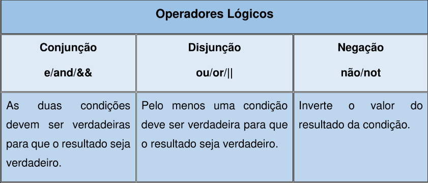
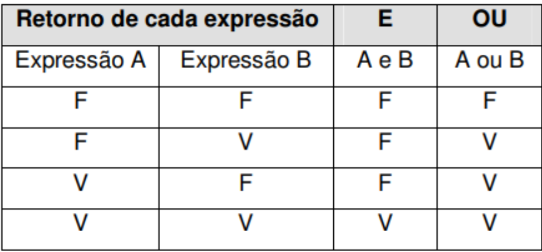
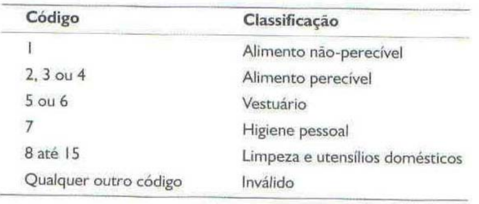

## <span style="font-size:40pt">Revendo estrutura de uma função</span>

>  minha_funcao = function(input1, input2) {  
>   ... operações ...  
>  return(output)  
>  }  

-  **Minha_funcao** é o nome da funcão.  
- **{ }** representam o início e o fim da função.
-  **Function** e **return**: palavras reservadas do R.
 - **Operações** são os cálculos que geram o output.

## <span style="font-size:40pt">**Estrutura de condição (if...else)**</span>

Permite executar um código quando a condição é verdadeira e outro quando é falsa.

Sintaxe:
```r
if (condição) {
  # código se verdadeiro
} else {
  # código se falso
}
```

Exemplo:
```r
idade = 16
if (idade >= 18) {
  print("Maior de idade")
} else {
  print("Menor de idade")
}
```

## <span style="font-size:40pt">**Resolução dos exercícios anteriores**</span>
<br><br>
Abrir Aula2_Exerc_Resolvidos.R

## <span style="font-size:40pt">**Operadores Lógicos**</span>

Permitem comparar expressões em que o resultado pode ser **verdadeiro** ou **falso**, implementando a *lógica booleana*.



## <span style="font-size:40pt">**Operadores Lógicos**</span>

**Retorno das expressões**



## <span style="font-size:40pt">**Exemplo de Operador &**</span>

Usado para testar se duas condições são verdadeiras ao mesmo tempo.
```r
x <- 5
y <- 10

(x > 0) & (y > 0)      # TRUE (as duas condições são verdadeiras)
(x > 0) & (y < 0)      # FALSE (a segunda não é verdadeira)
```
## <span style="font-size:40pt">**Exemplo de Operador |**</span>

Retorna TRUE se pelo menos uma condição for verdadeira.
```r
idade <- 17
tem_autorizacao <- TRUE

(idade >= 18) | tem_autorizacao  # TRUE (tem autorização mesmo sendo menor)
(idade >= 18) | FALSE            # FALSE (nenhuma condição é verdadeira)
```

## <span style="font-size:40pt">**Operador != (Diferente de)**</span>

Verifica se dois valores são diferentes.  
Exemplo: 
```r
a <- 3
b <- 5

a != b       # TRUE  (3 é diferente de 5)
a != 3       # FALSE (3 não é diferente de 3)
```
Pode ser combinado com & e |:  
```r
nota <- 8
freq <- 65
(nota >= 7) & (freq != 0)  # TRUE (nota >=7 e freq diferente de 0)
```


## <span style="font-size:40pt">**Exemplo de Função com Operador Lógico**</span>

**Exemplo **
Crie uma função que receba um número inteiro e devolva se o número está no intervalo entre 5 e 10.
```r
f_intervalo = function(x) {
  if (x>=5 & x<=10) {
    return('SIM')
} else {
 return('NÃO')
  }
}  
```
Mesma função com as chaves {} abreviadas.
```r
f_intervalo = function(x) {
  if (x>=5 & x<=10) return('SIM')
  else return('NÃO')
}  
```

## <span style="font-size:40pt">**Exercícios de Operadores Lógicos**</span>
<br>
**Exercício 1**
Crie uma função que receba a idade e o sexo (T ou F para masculino) de uma pessoa e determine se está em idade militar.
<br>

:::{.fragment}
**Exercício 2**
Crie uma função que receba a nota e a frequencia em uma disciplina e devolva 'Aprovado' se a nota for maior que 7 e a frequência maior que 70%, caso contrário devolva 'Reprovado'.
:::

## <span style="font-size:40pt">**Exercícios de Operadores Lógicos**</span>
<br>

**Exercício 3**  
Parecido com o anterior, porém mais completo. Crie uma função que receba 4 notas bimestrais e a frequência de um aluno. A função deve calcular a média anual do aluno e depois devolver 'Aprovado' ou 'Reprovado', da mesma maneira que o exercício anterior.

## <span style="font-size:40pt">**Exercícios de Operadores Lógicos**</span>
<br>

**Exercício 4**  
Crie uma função que receba três valores (a,b e c) representando os lados de um triângulo e devolva a classificação do triângulo:  
- 'Equilátero' se todos os lados forem iguais.  
- 'Isósceles' se dois lados forem iguais.  
- 'Escaleno' se todos forem diferentes.


## <span style="font-size:40pt">**Exercícios de Operadores Lógicos**</span>
<br>

**Exercício 5**
Crie uma função que receba o salário de um funcionário e o seu cargo (A ou B) e devolva o valor do aumento salarial na seguinte forma:
- Cargo A: se o salário for menor que 2000, aumenta 20%. Se for maior, aumenta 10%.
- Cargo B: se o salário for menor que 6000, aumenta 10%. Se for maior, aumenta 5%.


## <span style="font-size:40pt">**Exercícios de Operadores Lógicos**</span>
<br>

**Exercício 6**  
Crie uma função que receba um número e determine se devolva se ele é:  
- 'Positivo e par'  
- 'Positivo e ímpar'  
- 'Negativo'  
- 'Zero'

## <span style="font-size:40pt">**Exercícios de Operadores Lógicos**</span>
**Exercício 7.** Crie uma função que receba um número inteiro e devolva TRUE or FALSE se aquele ano é bissexto ou não, sabendo que ano bissexto é aquele divisível por 4 ou divisível por 400.

:::{.fragment}
**Exercício 8** 
Crie uma função que receba três variáveis (renda, idade e score) e de termine se o banco pode realizar o empréstimo, sendo "Autorizado" se a idade for maior que 25 e a renda for maior que 3000, ou então se o score for maior que 750. Caso contrário, será "Negado".
:::

## <span style="font-size:40pt">**Exercícios de Operadores Lógicos**</span>
<br>
**Exercício 9**   
Crie uma função que receba a altura (H) e o sexo de uma pessoa e determine seu peso ideal, baseado nas seguintes fórmulas:  
- para homens (72,7 x H) - 58  
- para mulheres (62,1 x H) - 44,7

## <span style="font-size:40pt">**Exercícios de Operadores Lógicos**</span>
**Exercício 10**   
Crie uma função que receba os valores de pressão e glicose e devolva o resultado da avaliação de risco de infarte:  
*  'Risco alto' se a pressão for maior que 140 e a glicose maior que 125.  
* 'Risco moderado' se a pressão for maior que 140 ou a glicose maior que 125.  
* 'Risco baixo' caso contrário.


## <span style="font-size:40pt">**Exercícios de Operadores Lógicos**</span>
**Exercício 11 (Desafio!)**   
Crie uma função que receba o código de produto e devolva sua classificação, conforme a tabela de referência:  




