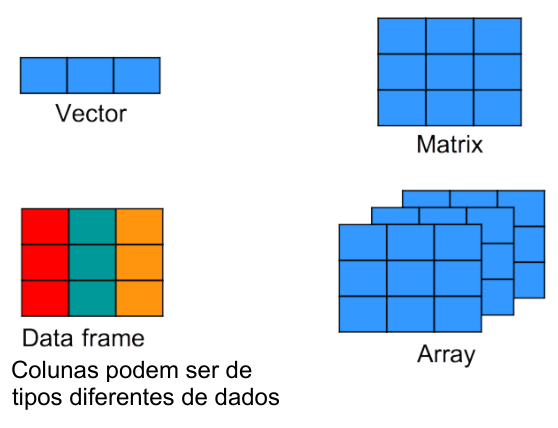
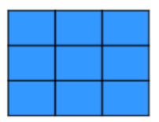
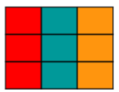

## 
**Exercício 8 (DESAFIO da aula passada).** 

Crie uma função que receberá dois números (a e b) e imprima a tabuada de a até b.  
Por exemplo: imprimir a tabuada de 1 até 10.

<!--
"Tabuada do 1"  
"1 x 1 = 1"  
"1 x 2 = 2"  
...
"Tabuada do 2"  
"2 x 1 = 2"  
"2 x 2 = 4"  
... etc até a tabuada do 10.
-->

## <span style="font-size:40pt">Estruturas de repetição WHILE no R </span>

Estruturas de repetição (loops ou laços) circulam (iteram) pelos itens até que parem.

**Diferenças entre FOR e WHILE**

* **FOR**: executa um bloco de código um número fixo de vezes, iterando sobre um vetor.
```r
for (i in 1:5) {
 print(i)
}
```

##
* **WHILE**: executa um bloco de código enquanto uma condição for verdadeira.

*while (condição_lógica) {  
  # bloco de código  
}*  

**Exemplo 1**. Contar até 5 com while:
```{r echo=T}
i = 1             # Variável de inicialização
while (i <= 5) {
  print(i)
  i = i + 1
}
```

##
**Exemplo 2**. Realizar uma contagem regressiva
```{r echo=T}
i = 10
while (i >= 1) {
  print(i)
  i = i - 1
}
```

##
**Exemplo 3**. Realizar a soma dos 100 primeiros números

```{r echo=T}
soma = 0
i = 1
while (i <= 100) {
  soma = soma + i
  i = i + 1
}

print(soma)
```


# Encerramos os 5 fundamentos da lógica da programação!!!

* Function  
* IF  
* ELSE  
* FOR  
* WHILE  

## <span style="font-size:40pt">Retornando às estruturas de dados do R </span>



##
**VETOR**: série de números (ou caracteres). Vetor tem uma dimensão.  


```r
#### Exemplos:
v = c(1,2,3,4,5)
vs = c('A','B','C','D')

#### Funções vetoriais
length(v)
sum(v)

#### Índices de vetores
v[1]            # Primeiro elemento
v[length(v)]    # Último elemento
v[3] = 99       #Atribuir um elemento individual

#### Filtragem lógica com operadores booleanos
v[(v < 3) & (v != 0 )]      
```
<br>

##
**MATRIZ**: série de vetores do mesmo tipo (numérico ou de caracteres). 
Matriz tem 2 dimensões (linhas e colunas).

  
```{r echo=TRUE}
#### Exemplos:
v1 = c(1,2,3,4)
v2 = c(6,7,8,9)
v3 = c(10,11,12,13)
m = cbind(v1,v2,v3)
m
```

##
**MATRIZES**: Índices de matrizes  

```{r echo=TRUE}
m = matrix(1:12, nrow=4)
m
#### Usando índices de matrizes 
#### m[linha,coluna]
m[2,3]    # Selecionando o elemento da linha 2 e coluna 3
m[3,]     # Para selecionar a terceira linha inteira (vetor)
m[,2]     # Para selecionar a segunda coluna inteira (vetor)
```

##
**MATRIZES**: Índices de matrizes

```{r echo=TRUE}
m[c(1,3),]   # Selecionando o primeira e terceira linhas (submatriz)  
m[2:4,c(1,3)]   # Selecionando as linhas de 2 a 4 e as colunas 1 e 3 (submatriz)
```

##
**Funções específicas para matrizes**
```{r echo=TRUE}
ncol(m)    # Número de colunas da matriz m
nrow(m)    # Número de linhas da matriz m
dim(m)     # Dimensões da matriz (vetor do número de linhas e colunas)
t(m)       # Transposição da matriz (linhas viram colunas)
```

##
**ARRAY**: muitas dimensões.  

:::{.fragment}
Array generaliza a matriz para n-dimensões.
:::
:::{.fragment}
Em array, todos os dados são do mesmo tipo, assim como as matrizes.
:::
:::{.fragment}
Array é pouco usada em problemas aplicados.
:::
:::{.fragment}  
Array é usada em conceitos matemáticos multi-dimensionais.
:::
:::{.fragment}  
Não se preocupe muito com elas, apenas entenda o conceito de multi-dimensional, baseado em Linhas X Colunas X Camadas, e que isso pode mais mais dimensões ainda.
:::

##
**Criando arrays**
```{r echo=T}
x = 1:24
A = array(x, dim = c(3,4,2))  # Array 3D: (linhas, colunas, "camadas")
A
dim(A)
```

##
**DATAFRAME** = planilha (colunas de diferentes tipos de dados)

  

:::{.fragment}  
* Dataframe sempre é bidimensional (Linhas X Colunas).
:::
:::{.fragment}  
* Cada coluna é um vetor do mesmo comprimento.
:::
:::{.fragment}  
* Cada coluna pode ser de um tipo diferente de dado (numérico ou de caracteres).
:::
:::{.fragment}  
* R pode substituir o Excel em planilhagem.
:::

## <span style="font-size:40pt">Criando um dataframe</span>
Como criar um Dataframe usando a função **data.frame()**
```{r echo=T}
nome = c('Fulano','Beltrano','Ciclano')  # Criando o vetor de nomes
idade = c(12,18,20)
id = 101:103
df = data.frame(nome,idade,id)
df
```
Seleção de dados feita como matrizes, usando os índíces bidimensionais (Linhas X Colunas).
```{r echo=T}
df[1:2,2:3]
```


## 
**Extraindo os vetores das colunas usando $ e o nome da coluna**
```{r echo=T}
df$idade
df$nome
```
Para criar uma nova coluna usando **$**, basta atribuir o valor a um novo nome de coluna (apelido).
```{r echo=T}
df$apelido = c('A','B','C')
df
```

## <span style="font-size:40pt">Exemplo 1:</span>

Crie um dataframe com 4 colunas e 4 linhas, assim:

id (1..4), sexo (M/F), altura (m), peso (kg).  

Depois, calcule o IMC (= peso/altura^2) como nova coluna.

:::{.fragment}  
```{r echo=T}
id = 1:4
sexo = c('F','M','M','F')
altura = c(1.58, 1.87, 1.75, 1.72)
peso = c(62, 91, 78, 72)
df1 = data.frame(id,sexo,altura,peso)
df1$imc = trunc(df1$peso / df1$altura^2)
df1
```
:::

##
**Índices em dataframes**: 
Assim como matrizes,  dataframes são bidimensionais (Linhas X Colunas).
```{r echo=T}
df1
df1[1,2]  # Extrai o elemento da linha 1 e coluna 2.
df1[3,]   # Extrai apenas a terceira linha.
df1[,2]   # Extrai apenas a segunda coluna.
df1$sexo  # Também extrai a segunda coluna
```

##
```{r echo=T}
df1
df1[c(1,3),]   # Extrai a linha 1 e a linha 3 inteiras.
df1[c(1,3),2]   # Extrai a linha 1 e a linha 3 da segunda coluna.
df1[1:3,1:3]   # Extrai da linha 1 até a linha 3 das colunas de 1 a 3. 
```

##
Como o vetor **df1** foi criado com os nomes das colunas, podemos selecioná-las pelo nome.
```{r echo=T}
df1
# Selecionando todas as linhas e 2 colunas.

df1[,c('id','sexo')]  
```

## <span style="font-size:40pt">Os poderosos filtros em dataframes no R</span>
Os filtros funcionam tal como em vetores e matrizes, aplicados separadamente às linhas e colunas do dataframe.  
```{r echo=T}
df1
# Selecionando as linhas com imc > 24

df1[df1$imc > 24, ]  
```

##
```{r echo=T}
df1
# Selecionando as linhas das mulheres com peso < 77

df1[(df1$sexo=='F') & (df1$peso < 77) , ]  

# Selecionando as linhas dos homens com peso > 80 e mostrando apemas o id e imc.

df1[(df1$sexo=='M') & (df1$peso > 80) , c('id','imc')]  
```

## <span style="font-size:40pt">Exercícios de dataframes</span>

Considere o seguinte dataframe proveniente de uma campanha de amostragem de bentos:
```{r echo=T}
local = c('L1','L1','L1','L2','L2','L2')
amostra = c('a1','a2','a3','a1','a2','a3')
abund = c(23,45,0,56,0,25)
```
Com esses dados, crie um dataframe chamado "dados" e responda:  
1 - Extraia o vetor correspondente à primeira coluna.  
2 - Extraia o elemento da segunda linha e terceira coluna.  
3 - Extraia apenas as linhas correspondentes aos locais L1.  

##
4. Extraia apenas as linhas dos locais L2 em que a abundância seja maior que 30. 

5. Extraia apenas as colunas **amostra** e **abund** dos locais L1 em que a abundância seja diferente de zero. 

6. DESAFIO: Crie uma nova coluna no dataframe chamada **pres_aus** com valores de 1 e 0 para presença e ausência de abundância.

##
**Manipulação de arquivos no R para abrir planilhas do Excel como dataframe no R**

* **Working dir** no RStudio: como manipular.
* Criar uma planilha no Excel, como nome de coluna e salvar como formato csv.
* No R, abrir o arquivo usando a função `read.csv` ou `read.csv2`. 
* Alternativamente, é possível abrir um arquivo Excel (xls ou xlsx) diretamente no R, usando o pacote `readxl`.
